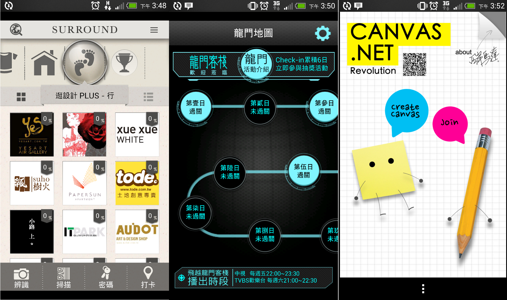
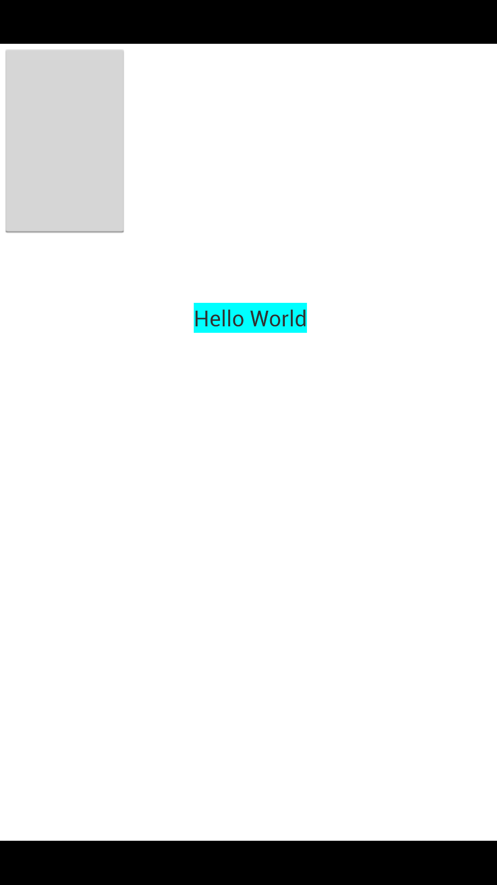

RatioFixer
==========

By using this library, developer can use absolute position which based on virtual coordinate to specify UI position. 

#Showcase:
The following apps are made with RatioFixer. They will look identical on all android devices, for any screen size.

From left to right:

###[Surround](https://play.google.com/store/apps/details?id=itri.u9.surround)
An app for The Designer Week Event 2013 in Taiwan, helps you to explore the surrounding store by solving simple missions.

###[Dragon Gate Inn](https://play.google.com/store/apps/details?id=itri.u9.dragongateinn)
An app for Dragon Gate Inn tv program in taiwan, use audio recognize technique to checkin while watching tv show.

###[Canvas.Net](https://play.google.com/store/apps/details?id=ntu.csie.wcmlab.canvasnetfree)
This application is used for Synchronized Canvas. By using this, You can not only draw yourself, 
but also draw with your friend together. In this application, it has many functionality, 
such as "pick color to draw, with a parameter of transparency", "use eraser", "undo/redo", "clear the page", 
"save/load the image into/from SD card" and etc. It will be the best entertainment application for 
you and your friends during the boring time!!!

#Basic Usage:

	protected void onCreate(Bundle savedInstanceState) {
		super.onCreate(savedInstanceState);

		RatioRelativeLayout mView = new RatioRelativeLayout(this);
		mView.setBackgroundColor(Color.WHITE);
		
		Button bt1 = new Button(this);
		
		//add bt1 to mView at (0,0) with width = 200 and height = 300
		mView.addView(bt1, 200, 300, 0, 0);
		
		TextView tv1 = new TextView(this);
		tv1.setText("Hello World");
		tv1.setBackgroundColor(Color.CYAN);
		
		//add tv1 to mView at (300,400) with wrap_content width and height
		mView.addView(tv1, RelativeLayout.LayoutParams.WRAP_CONTENT, RelativeLayout.LayoutParams.WRAP_CONTENT, 300, 400);
		
		mView.setToContentView(this);

 	}

this will make the follow layout on all devices:

You can also use the following RatioRelativeLayout contructor to specify virtual size:

	RatioRelativeLayout(context,width,heigth);

or configure the activity it attaches to use full screen mode or not in boolean:

	RatioRelativeLayout(context,width,heigth,useFullScreen);

###RatioFixer:

RatioFixer is a class that maintains relationship between virtual size and physical size for each RatioRelativeLayout.

You can obtain RatioFixer by using getRatioFixer() method of RatioRelativeLayout, then use getRatio() method to get value of (physical size)/(virtual size)

Alternatively, you can directly use getRealValue(virtual width/height) to get real pixel length on screen by given virtual width/heigth. 

Operating RatioFixer may be useful in some circumstances such like add padding or set text size,

because these methods in Android sdk are not under control of RatioRelativeLayout and use pixel as parameter unit instead of our own defined virtual size.

As the consquence, we have to translate virtual size which we'd like to use to real pixel length manually.

for example:

	RatioRelativeLayout mainLayout = new RatioRelativeLayout(this);
	RatioFixer rf = mainLayout.getRatioFixer(); 
	
	btn1.setPadding(rf.getRealValue(5), rf.getRealValue(5), 0, 0);

#Note:

0. Everything add to layout by using addView(View view,int width,int height,int x, int y) method will be calculated to real pixel size according to different devices. 

1. Action bar always be hidden by RatioRelativeLayout. 

2. Default virtual size for acitivitys with status bar is 

    int VIRTUALWIDTH = 768;
    int VIRTUALHEIGHT = 1230;

    without status bar is 
   
    int VIRTUALWIDTH = 768;
    int VIRTUALHEIGHT = 1280;
    
#Some useful tips when using RatioFixer

0. When use EditText component, RatioRelativeLayout may being wrong measured after the Ime(input method) keyboard raised.
   the situation will cause RatioRelativeLayout layout broken. you can set following configure in the acitivty to fix the
   problem.

		this.getWindow().setSoftInputMode(WindowManager.LayoutParams.SOFT_INPUT_STATE_ALWAYS_HIDDEN | WindowManager.LayoutParams.SOFT_INPUT_ADJUST_PAN);

1. You can you followint statement to make text size identical on all devices.

		mTestBtn.setTextSize(TypedValue.COMPLEX_UNIT_PX,getRatioFixer().getRealValue(60));
	
#LICENSE
Copyright 2013 U9Lab,Industrial Technology Research Institute.  
Licensed under the Apache License, Version 2.0
